# LocustHub 用户使用手册

本文面向本地调试、功能验收和后续 PaaS 部署使用。截图采集于 2026-07-01 的本地集成服务，访问地址为 `http://127.0.0.1:8000/`。

## 1. 访问入口

1. 启动后端集成服务后，浏览器访问 `http://127.0.0.1:8000/`。
2. API 文档访问 `http://127.0.0.1:8000/docs`。
3. 管理台采用前后端不分离交付，FastAPI 直接托管 `frontend/dist` 静态资源。

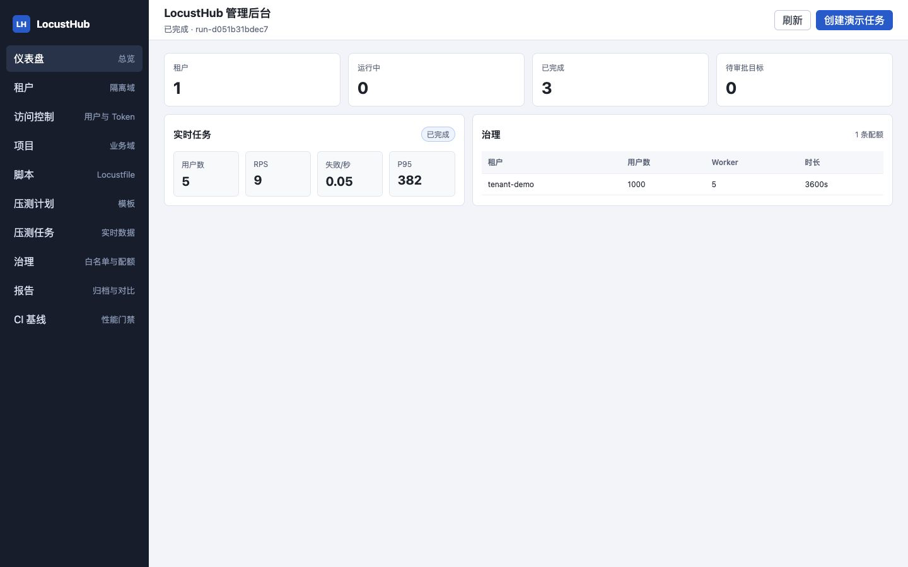

## 2. 仪表盘

仪表盘用于快速确认平台总体状态：

- `租户`：当前平台内租户数量。
- `运行中`：当前仍在执行的压测任务数量。
- `已完成`：已完成归档链路的任务数量。
- `待审批目标`：目标白名单中尚未批准的条目。
- `实时任务`：展示当前选中任务的用户数、RPS、失败/秒和 P95。
- `治理`：展示租户配额，包括最大用户数、Worker 数和任务时长限制。

## 3. 脚本管理

进入 `脚本` 模块后，可以维护 Locustfile 版本：

1. 填写脚本名称、租户、项目和依赖。
2. 在 `Locustfile` 输入框粘贴或编辑脚本。
3. 点击 `校验 Locustfile`，平台会做语法和任务数量校验。
4. 校验通过后点击 `创建脚本版本`，新版本会进入列表，可被压测计划引用。

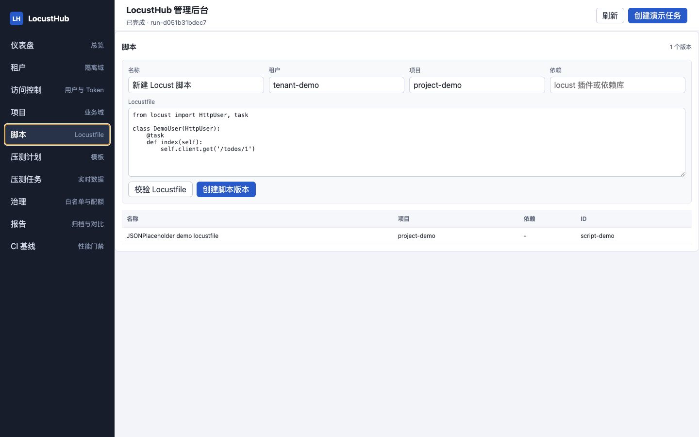

## 4. 压测计划

`压测计划` 是可复用的任务模板，包含目标地址、并发用户、生成速率、时长和 Worker 数。

1. 选择脚本版本 ID。
2. 填写目标地址，例如 MVP 默认的 `https://jsonplaceholder.typicode.com`。
3. 设置用户数、生成速率、任务时长和 Worker 数。
4. 点击 `创建压测计划`。
5. 如需基于已有计划微调参数，可点击 `复制计划`。

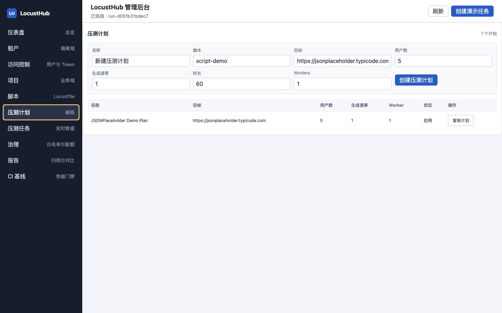

## 5. 压测任务与实时指标

进入 `压测任务` 后，可以查看任务列表并选择当前任务。上方操作按钮提供：

- `采集`：从 Locust 运行时或模拟运行时采集一次最新指标。
- `停止`：停止任务、采集最终指标、归档报告并销毁临时泳道资源。
- `重跑`：基于当前任务的计划重新创建一条任务。

`统计` 页签字段参照 Locust UI，包括请求数、失败数、中位数、平均、最小、最大、当前 RPS、95% 和 99% 响应时间。

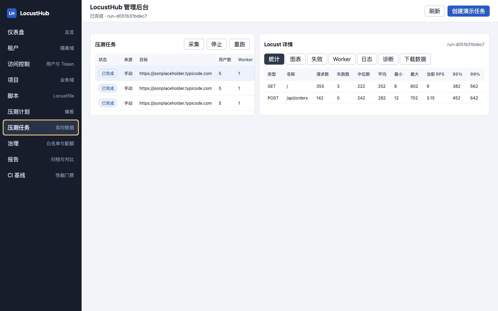

`图表` 页签展示 RPS、失败/秒、响应时间和用户数趋势，便于观察任务运行过程中的波动。

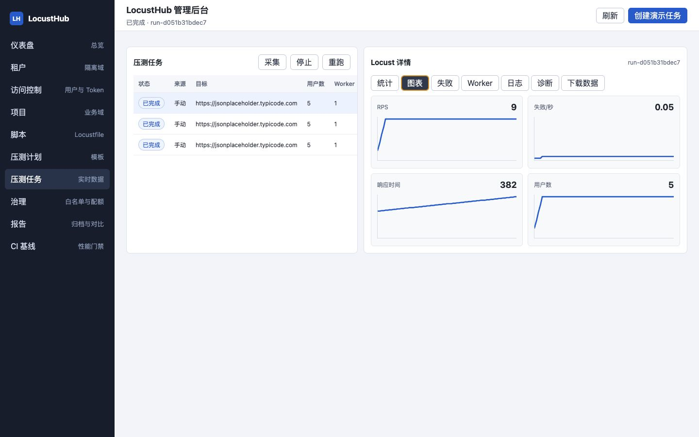

`日志` 页签展示异常统计和 Master 日志预览。任务归档后，日志会作为报告工件保存。

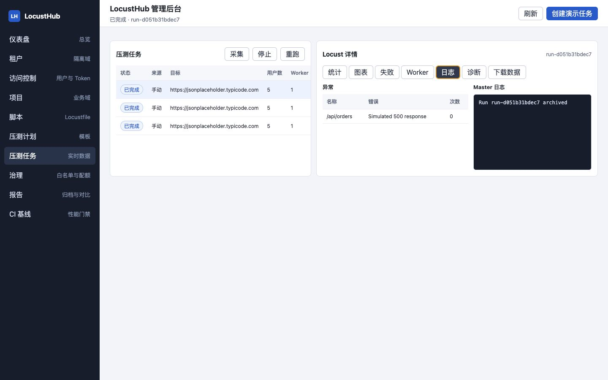

`下载数据` 页签展示报告状态、总请求数和可下载工件。归档完成后可下载 Locust 原生 HTML 报告、请求 CSV、失败 CSV、异常 CSV、历史 CSV 和 Master 日志。若本地模拟运行或真实 Locust master 已不可访问，页面会展示平台 HTML 报告作为兜底，并保留 CSV/日志下载。

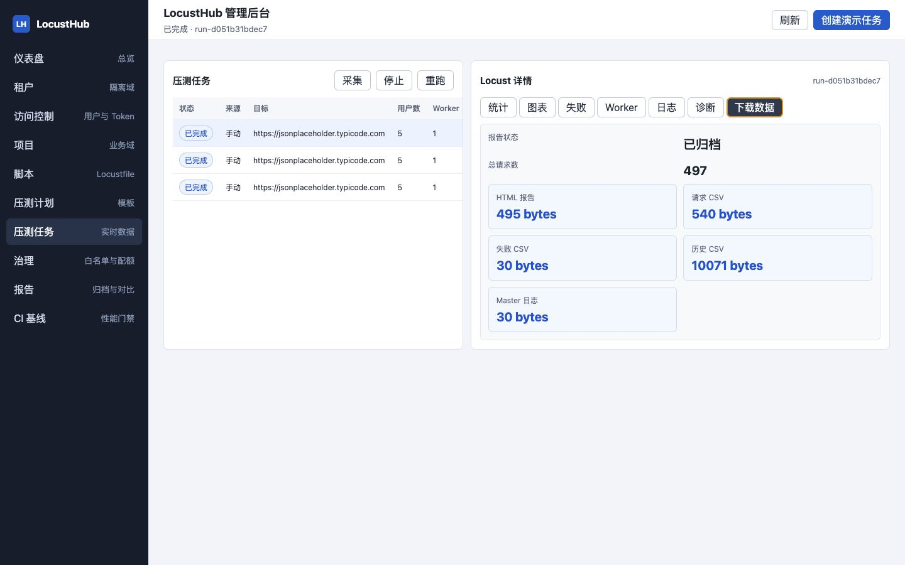

## 6. 治理与准入

`治理` 模块用于查看目标白名单、审批请求、DNS/IP 风险快照和配额准入快照。

- 目标白名单限制压测目标，只允许经过审批的域名、IP 或 CIDR。
- 审批请求记录目标、配额等治理对象的审批状态。
- 准入快照保存 DNS 解析结果、私网 IP 风险、Worker/用户数/时长等配额决策。
- Kubernetes 部署时可继续映射到 namespace、service account、quota 和 NetworkPolicy。

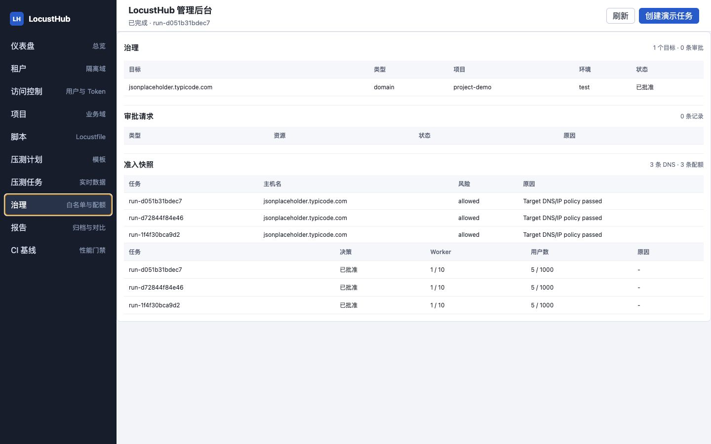

## 7. 报告归档与对比

任务停止后，平台会优先从 Locust master 的 `/stats/report` 归档原生 HTML 报告，同时归档 CSV/日志工件。当前本地模式保存到本地对象存储适配目录，部署模式可切换到阿里云 OSS。

`报告` 模块提供：

- 当前选中报告的总请求数、总失败数、平均响应和 P95。
- 历史 P95、RPS、失败率趋势。
- 已归档报告列表和下载项数量。
- 最新报告与上一次报告的 P95、失败率差异。

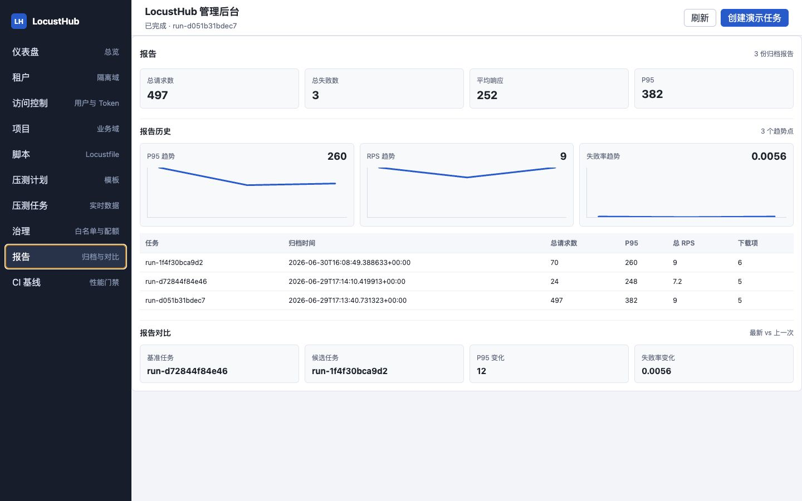

## 8. 访问控制

`访问控制` 模块用于管理本地 MVP 的用户和 API Token：

1. 在 `创建用户` 区域填写租户、用户名、密码和角色。
2. 在 `创建 API Token` 区域填写 Token 名称和 scope。
3. 创建后只展示一次 Token 明文，请立即记录到 CI Secret。
4. 不再使用的 Token 可以点击 `撤销 Token`。

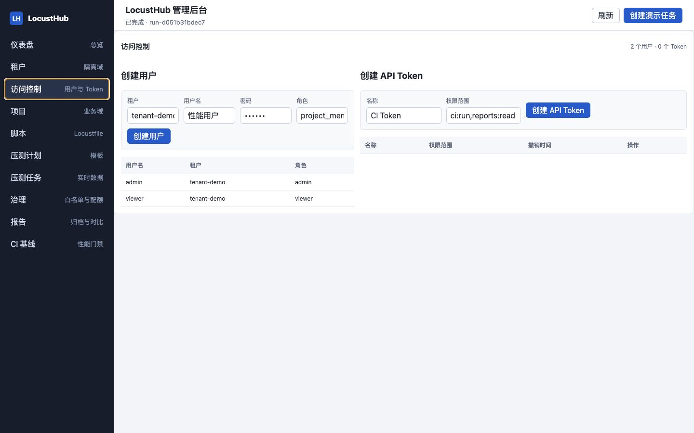

## 9. CI 基线

`CI 基线` 模块用于维护性能门禁阈值：

- `最大 P95`：候选任务 P95 不能超过该值。
- `最大失败率`：候选任务失败率不能超过该值。
- `最小 RPS`：候选任务吞吐不能低于该值。

CI 接入时，流水线可以使用 API Token 调用 CI 性能任务接口，平台按 Profile 阈值返回基线结果。

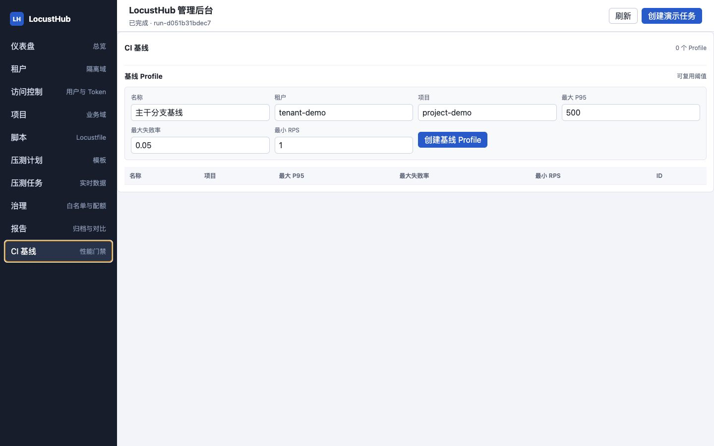

## 10. Swagger API 文档

FastAPI 已开启 Swagger。访问 `http://127.0.0.1:8000/docs` 后，可以查看租户、项目、脚本、计划、任务、报告、治理、访问控制和 CI 基线接口。

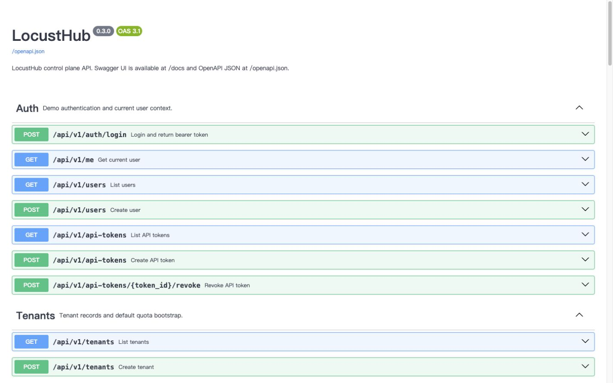

## 11. 本地验收建议

建议按以下顺序验收：

1. 打开仪表盘，确认中文导航、实时任务、配额信息可见。
2. 在脚本模块校验默认 Locustfile。
3. 在压测计划模块创建或复制一个计划。
4. 在压测任务模块点击 `创建演示任务`，再查看统计、图表、日志和下载页签。
5. 停止任务后，确认报告归档和下载项出现。
6. 在报告模块确认趋势图和报告对比。
7. 在治理模块确认目标白名单、审批和准入快照。
8. 打开 Swagger，确认接口分组和字段注释可读。

## 12. 报告与工件存储

本地调试时，归档报告由后端对象存储适配层保存；接入阿里云 OSS 后，报告工件按租户、项目、任务前缀组织，便于生命周期管理和权限隔离。报告元数据保存在数据库中，HTML/CSV/日志等大文件放在对象存储中。
